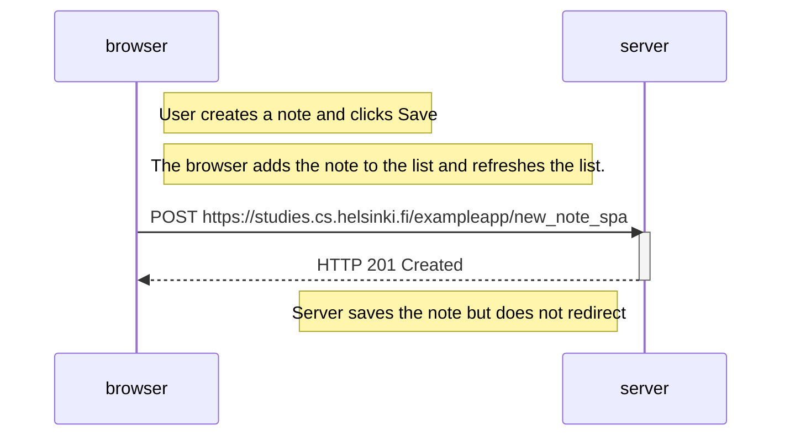

```mermaid
sequenceDiagram
    participant browser
    participant server

    Note right of browser: User creates a note and clicks Save

    Note right of browser: The browser adds the note to the list and refreshes the list.

    browser->>server: POST https://studies.cs.helsinki.fi/exampleapp/new_note_spa
    activate server
    server-->>browser: HTTP 201 Created
    deactivate server

    Note left of server: Server saves the note but does not redirect
```